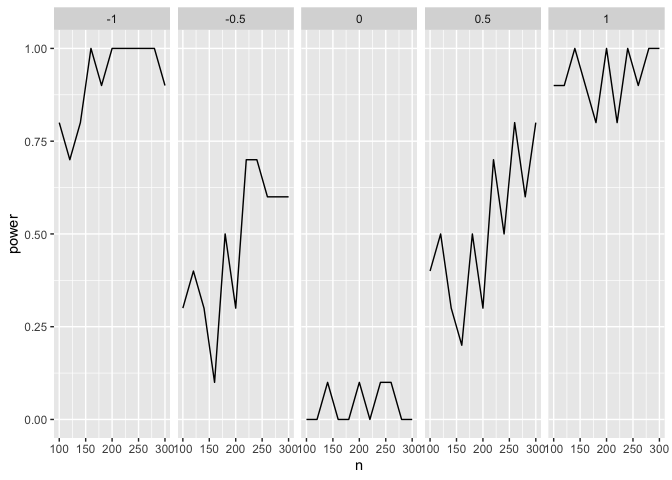

[](https://travis-ci.com/statisfactions/simpr)

# simpr

`simpr` provides a simple and tidyverse-friendly syntax for specifying
and generating simulations, especially for power analysis. The primary
workflow is:

1.  Specify **variables** for your simulation data, with `specify()`
2.  Specify **parameters** that you want to systematically vary between
    different cells of your simulation design (e.g. *n*, effect size,
    distribution type), with `define()`
3.  Generate the simulation data with `generate()`
4.  Fit models with your data (e.g. `lm()`), with `fit()`
5.  Tidy the model output for further processing, such as computing
    power or Type I Error rates, with `tidy_fits`

## Installation and loading

``` r
remotes::install_github("statisfactions/simpr")

library(simpr)
```

## Introductory example: regression with three variables

Let’s say we want to see our power to detect an interaction in a linear
model. We can completely run the simulation and calculate *p* values
with a just a few lines of code:

``` r
set.seed(100)
simpr_tidy = ## Specify the simulation
  specify(x1 = ~ 2 + rnorm(n),
                       x2 = ~ 3 + 2*x1 + rnorm(n, 0, sd = 0.5),
                       y = ~ 5 + b1*x1 + b2*x2 + g1*x1*x2 + 10 * rnorm(n)) %>%
  define(n = seq(100, 300, by = 20),
       b1 = 1,
       b2 = 1,
       g1 = seq(-1, 1, by = 0.5)) %>% 
  ## Generate the data
  generate(10) %>% 
  ## Fit models
  fit(lm = ~lm(y ~ x1*x2, data = .)) %>% 
  ## Calculate the output
  tidy_fits
```

This gives a tibble with slope estimates and *p* values which we can use
to plot the power curves:

``` r
library(ggplot2)
library(dplyr)

simpr_tidy %>%
  filter(term %in% "x1:x2") %>%
  group_by(n, g1) %>%
  summarize(power = mean(p.value < 0.05)) %>%
  ggplot(aes(n, power)) +
  geom_line() +
  facet_grid(~g1)
```



### Breaking down the example

First, we specify how we want the data to be generated:

``` r
simpr_spec = specify(x1 = ~ 2 + rnorm(n),
                       x2 = ~ 3 + 2*x1 + rnorm(n, 0, sd = 0.5),
                       y = ~ 5 + b1*x1 + b2*x2 + g1*x1*x2 + 10 * rnorm(n)) %>%
  define(n = seq(100, 300, by = 20),
       b1 = 1,
       b2 = 1,
       g1 = seq(-1, 1, by = 0.5))
```

The call to `specify()` contains the basics of what we actually want
simulated. Each argument is a named, one-sided formula that can include
functions like `rnorm` or whatever else you want, specified similar to
`purrr` formula functions. Note that these arguments include both
references to previously defined variables (`x1` and `x2`), and to some
other variables not yet defined (`n`, the sample size; `b1`, the slope
of `x1`; `b2`, the slope of `x2`; `g1`, the interaction slope).

We can define these variables, which we call *metaparameters* of the
simulation, in the `define()` command. `define()` also takes named
arguments, and here we define what those metaparameters are. We can
specify them either as constants, or as lists or vectors; `simpr` will
generate all possible combinations of these metaparameters and run the
simulation for each combination using `generate()`:

``` r
simpr_gen = simpr_spec %>% 
  generate(10)
```

`generate` has one argument, the number of repetitions for each
simulation. Here we generate 10 repetitions. This produces a `tibble`
with one row for each combination of metaparameters and repetition, and
a list-column with the generated data.

``` r
simpr_gen
```

    ## full tibble
    ## --------------------------
    ## # A tibble: 550 × 7
    ##    .sim_id     n    b1    b2    g1   rep sim               
    ##      <int> <dbl> <dbl> <dbl> <dbl> <int> <list>            
    ##  1       1   100     1     1    -1     1 <tibble [100 × 3]>
    ##  2       2   120     1     1    -1     1 <tibble [120 × 3]>
    ##  3       3   140     1     1    -1     1 <tibble [140 × 3]>
    ##  4       4   160     1     1    -1     1 <tibble [160 × 3]>
    ##  5       5   180     1     1    -1     1 <tibble [180 × 3]>
    ##  6       6   200     1     1    -1     1 <tibble [200 × 3]>
    ##  7       7   220     1     1    -1     1 <tibble [220 × 3]>
    ##  8       8   240     1     1    -1     1 <tibble [240 × 3]>
    ##  9       9   260     1     1    -1     1 <tibble [260 × 3]>
    ## 10      10   280     1     1    -1     1 <tibble [280 × 3]>
    ## # … with 540 more rows
    ## 
    ## sim[[1]]
    ## --------------------------
    ## # A tibble: 100 × 3
    ##       x1    x2      y
    ##    <dbl> <dbl>  <dbl>
    ##  1  1.38  5.26  -5.20
    ##  2  1.67  6.38  -2.88
    ##  3  2.90  9.08 -23.7 
    ##  4  1.14  5.21  12.6 
    ##  5  1.28  4.72   6.11
    ##  6  1.24  5.77   3.47
    ##  7  1.75  6.24   1.48
    ##  8  3.03  8.64  -9.34
    ##  9  2.11  7.68 -15.9 
    ## 10  3.19  8.69  -5.24
    ## # … with 90 more rows

Note the first 5 rows have everything the same with the column `n`, but
`g1` varies, and each element of `sim` is a tibble with 100 rows; then
on the sixth row, we have the next value of `n`, 120, and a tibble with
120 rows, and so on. Each element of `sim` contains the generated `x1`,
`x2`, and `y`, e.g.

``` r
simpr_gen$sim[[1]]
```

    ## # A tibble: 100 × 3
    ##       x1    x2      y
    ##    <dbl> <dbl>  <dbl>
    ##  1  1.38  5.26  -5.20
    ##  2  1.67  6.38  -2.88
    ##  3  2.90  9.08 -23.7 
    ##  4  1.14  5.21  12.6 
    ##  5  1.28  4.72   6.11
    ##  6  1.24  5.77   3.47
    ##  7  1.75  6.24   1.48
    ##  8  3.03  8.64  -9.34
    ##  9  2.11  7.68 -15.9 
    ## 10  3.19  8.69  -5.24
    ## # … with 90 more rows

Next, we can fit a model on this data using the `fit()` function; this
uses similar formula syntax to `specify()`:

``` r
simpr_fit = simpr_gen %>% 
  fit(lm = ~lm(y ~ x1*x2, data = .))
```

Using `purrr` syntax, we refer to each simulated dataset that we want to
fit the model to as `.`.

This just adds a list-column onto `simpr_gen` with the model fit for
each rep and metaparameter combination:

``` r
simpr_fit
```

    ## full tibble
    ## --------------------------
    ## # A tibble: 550 × 8
    ##    .sim_id     n    b1    b2    g1   rep sim                lm    
    ##      <int> <dbl> <dbl> <dbl> <dbl> <int> <list>             <list>
    ##  1       1   100     1     1    -1     1 <tibble [100 × 3]> <lm>  
    ##  2       2   120     1     1    -1     1 <tibble [120 × 3]> <lm>  
    ##  3       3   140     1     1    -1     1 <tibble [140 × 3]> <lm>  
    ##  4       4   160     1     1    -1     1 <tibble [160 × 3]> <lm>  
    ##  5       5   180     1     1    -1     1 <tibble [180 × 3]> <lm>  
    ##  6       6   200     1     1    -1     1 <tibble [200 × 3]> <lm>  
    ##  7       7   220     1     1    -1     1 <tibble [220 × 3]> <lm>  
    ##  8       8   240     1     1    -1     1 <tibble [240 × 3]> <lm>  
    ##  9       9   260     1     1    -1     1 <tibble [260 × 3]> <lm>  
    ## 10      10   280     1     1    -1     1 <tibble [280 × 3]> <lm>  
    ## # … with 540 more rows
    ## 
    ## sim[[1]]
    ## --------------------------
    ## # A tibble: 100 × 3
    ##       x1    x2      y
    ##    <dbl> <dbl>  <dbl>
    ##  1  1.38  5.26  -5.20
    ##  2  1.67  6.38  -2.88
    ##  3  2.90  9.08 -23.7 
    ##  4  1.14  5.21  12.6 
    ##  5  1.28  4.72   6.11
    ##  6  1.24  5.77   3.47
    ##  7  1.75  6.24   1.48
    ##  8  3.03  8.64  -9.34
    ##  9  2.11  7.68 -15.9 
    ## 10  3.19  8.69  -5.24
    ## # … with 90 more rows
    ## 
    ## lm[[1]]
    ## --------------------------
    ## 
    ## Call:
    ## lm(formula = y ~ x1 * x2, data = .)
    ## 
    ## Coefficients:
    ## (Intercept)           x1           x2        x1:x2  
    ##      5.2005      -2.6840       1.2711      -0.7086

But we can simplify this a lot more for the purposes of power analysis
by using `tidy_fits()`, which runs `broom::tidy()` on each of the `lm`
objects and brings everything together into one data frame:

``` r
simpr_tidy = simpr_fit %>% 
  tidy_fits

simpr_tidy
```

    ## # A tibble: 2,200 × 12
    ##    .sim_id     n    b1    b2    g1   rep Source term        estimate std.error
    ##      <int> <dbl> <dbl> <dbl> <dbl> <int> <chr>  <chr>          <dbl>     <dbl>
    ##  1       1   100     1     1    -1     1 lm     (Intercept)    5.20      7.58 
    ##  2       1   100     1     1    -1     1 lm     x1            -2.68      5.68 
    ##  3       1   100     1     1    -1     1 lm     x2             1.27      2.11 
    ##  4       1   100     1     1    -1     1 lm     x1:x2         -0.709     0.389
    ##  5       2   120     1     1    -1     1 lm     (Intercept)   -0.463     6.51 
    ##  6       2   120     1     1    -1     1 lm     x1             6.05      4.48 
    ##  7       2   120     1     1    -1     1 lm     x2             2.05      1.80 
    ##  8       2   120     1     1    -1     1 lm     x1:x2         -1.67      0.355
    ##  9       3   140     1     1    -1     1 lm     (Intercept)   -4.33      6.01 
    ## 10       3   140     1     1    -1     1 lm     x1            -1.33      3.86 
    ## # … with 2,190 more rows, and 2 more variables: statistic <dbl>, p.value <dbl>

This gives a data frame with one row for each term for each combination
of metaparameters. We can easily plot power to detect the interaction
term using `dplyr` and `ggplot2`, as noted above, and these commands can
be easily chained.
