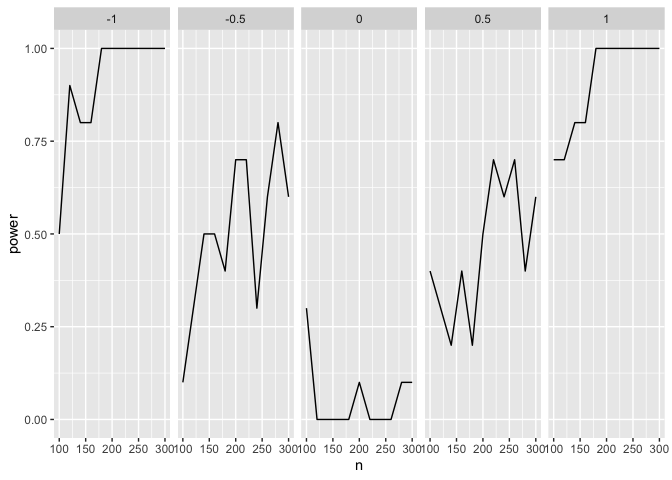

[](https://travis-ci.com/statisfactions/simpr)

simpr
=====

`simpr` provides a simple and tidyverse-friendly syntax for specifying
and generating simulations, especially for power analysis. The primary
workflow is:

1.  Specify **variables** for your simulation data, with `blueprint()`
2.  Specify **parameters** that you want to systematically vary between
    different cells of your simulation design (e.g. *n*, effect size,
    distribution type), with `meta()`
3.  Generate the simulation data with `produce_sims()`
4.  Fit models with your data (e.g. `lm()`), with `fit()`
5.  Tidy the model output for further processing, such as computing
    power or Type I Error rates, with `tidy_fits`
    
Learn more at the [useR! 2020 presentation](https://www.youtube.com/watch?v=MkfMSe9re2U) on `simpr`.

Installation
------------

``` r
remotes::install_github("statisfactions/simpr")
```

Introductory example: regression with three variables
-----------------------------------------------------

Let’s say we want to see our power to detect an interaction in a linear
model. We can completely run the simulation and calculate *p* values
with a just a few lines of code:

``` r
library(simpr)

set.seed(100)
simpr_tidy = ## Specify the simulation
  blueprint(x1 = ~ 2 + rnorm(n),
                       x2 = ~ 3 + 2*x1 + rnorm(n, 0, sd = 0.5),
                       y = ~ 5 + b1*x1 + b2*x2 + g1*x1*x2 + 10 * rnorm(n)) %>%
  meta(n = seq(100, 300, by = 20),
       b1 = 1,
       b2 = 1,
       g1 = seq(-1, 1, by = 0.5)) %>% 
  ## Generate the data
  produce_sims(10) %>% 
  ## Fit models
  fit(lm = ~lm(y ~ x1*x2, data = .)) %>% 
  ## Calculate the output
  tidy_fits
```

This gives a tibble with slope estimates and *p* values which we can use
to plot the power curves:

``` r
library(ggplot2)
library(dplyr)

simpr_tidy %>%
  filter(term %in% "x1:x2") %>%
  group_by(n, g1) %>%
  summarize(power = mean(p.value < 0.05)) %>%
  ggplot(aes(n, power)) +
  geom_line() +
  facet_grid(~g1)
```



### Breaking down the example

First, we specify how we want the data to be generated:

``` r
simpr_spec = blueprint(x1 = ~ 2 + rnorm(n),
                       x2 = ~ 3 + 2*x1 + rnorm(n, 0, sd = 0.5),
                       y = ~ 5 + b1*x1 + b2*x2 + g1*x1*x2 + 10 * rnorm(n)) %>%
  meta(n = seq(100, 300, by = 20),
       b1 = 1,
       b2 = 1,
       g1 = seq(-1, 1, by = 0.5))
```

The call to `blueprint()` contains the basics of what we actually want
simulated. Each argument is a named, one-sided formula that can include
functions like `rnorm` or whatever else you want, specified similar to
`purrr` formula functions. Note that these arguments include both
references to previously defined variables (`x1` and `x2`), and to some
other variables not yet defined (`n`, the sample size; `b1`, the slope
of `x1`; `b2`, the slope of `x2`; `g1`, the interaction slope).

We can define these variables, which we call *metaparameters* of the
simulation, in the `meta()` command. `meta()` also takes named
arguments, and here we define what those metaparameters are. We can
specify them either as constants, or as lists or vectors; `simpr` will
generate all possible combinations of these metaparameters and run the
simulation for each combination using `produce_sims()`:

``` r
simpr_gen = simpr_spec %>% 
  produce_sims(10)
```

`gen` has one argument, the number of repetitions for each simulation.
Here we generate 10 repetitions. This produces a `tibble` with one row
for each combination of metaparameters and repetition, and a list-column
with the generated data.

``` r
simpr_gen
```

    ## # A tibble: 550 x 6
    ##      rep     n    b1    b2    g1 sim_cell          
    ##    <int> <dbl> <dbl> <dbl> <dbl> <list>            
    ##  1     1   100     1     1  -1   <tibble [100 × 3]>
    ##  2     1   100     1     1  -0.5 <tibble [100 × 3]>
    ##  3     1   100     1     1   0   <tibble [100 × 3]>
    ##  4     1   100     1     1   0.5 <tibble [100 × 3]>
    ##  5     1   100     1     1   1   <tibble [100 × 3]>
    ##  6     1   120     1     1  -1   <tibble [120 × 3]>
    ##  7     1   120     1     1  -0.5 <tibble [120 × 3]>
    ##  8     1   120     1     1   0   <tibble [120 × 3]>
    ##  9     1   120     1     1   0.5 <tibble [120 × 3]>
    ## 10     1   120     1     1   1   <tibble [120 × 3]>
    ## # … with 540 more rows

Note the first 5 rows have everything the same with the column `n`, but
`g1` varies, and each element of `sim_cell` is a tibble with 100 rows;
then on the sixth row, we have the next value of `n`, 120, and a tibble
with 120 rows, and so on. Each element of `sim_cell` contains the
generated `x1`, `x2`, and `y`, e.g.

``` r
simpr_gen$sim_cell[[1]]
```

    ## # A tibble: 100 x 3
    ##        x1     x2      y
    ##     <dbl>  <dbl>  <dbl>
    ##  1  3.26   9.68    6.26
    ##  2  0.633  4.54  -14.2 
    ##  3  1.35   5.94   12.3 
    ##  4  2.41   7.36   -8.48
    ##  5  1.72   6.19  -11.6 
    ##  6  3.79  10.9    -7.31
    ##  7 -1.10   0.194  -9.93
    ##  8  3.79  11.0   -18.4 
    ##  9  2.08   7.59   11.6 
    ## 10  3.55   9.89  -36.5 
    ## # … with 90 more rows

Next, we can fit a model on this data using the `fit()` function; this
uses similar formula syntax to `blueprint()`:

``` r
simpr_fit = simpr_gen %>% 
  fit(lm = ~lm(y ~ x1*x2, data = .))
```

Using `purrr` syntax, we refer to each simulated dataset that we want to
fit the model to as `.`.

This just adds a list-column onto `simpr_gen` with the model fit for
each rep and metaparameter combination:

``` r
simpr_fit
```

    ## # A tibble: 550 x 7
    ##      rep     n    b1    b2    g1 sim_cell           lm    
    ##    <int> <dbl> <dbl> <dbl> <dbl> <list>             <list>
    ##  1     1   100     1     1  -1   <tibble [100 × 3]> <lm>  
    ##  2     1   100     1     1  -0.5 <tibble [100 × 3]> <lm>  
    ##  3     1   100     1     1   0   <tibble [100 × 3]> <lm>  
    ##  4     1   100     1     1   0.5 <tibble [100 × 3]> <lm>  
    ##  5     1   100     1     1   1   <tibble [100 × 3]> <lm>  
    ##  6     1   120     1     1  -1   <tibble [120 × 3]> <lm>  
    ##  7     1   120     1     1  -0.5 <tibble [120 × 3]> <lm>  
    ##  8     1   120     1     1   0   <tibble [120 × 3]> <lm>  
    ##  9     1   120     1     1   0.5 <tibble [120 × 3]> <lm>  
    ## 10     1   120     1     1   1   <tibble [120 × 3]> <lm>  
    ## # … with 540 more rows

But we can simplify this a lot more for the purposes of power analysis
by using `tidy_fits()`, which runs `broom::tidy()` on each of the `lm`
objects and brings everything together into one data frame:

``` r
simpr_tidy = simpr_fit %>% 
  tidy_fits

simpr_tidy
```

    ## # A tibble: 2,200 x 11
    ##        n    b1    b2    g1   rep Source term  estimate std.error statistic
    ##    <dbl> <dbl> <dbl> <dbl> <int> <chr>  <chr>    <dbl>     <dbl>     <dbl>
    ##  1   100     1     1  -1       1 lm     (Int…   3.02       7.59     0.399 
    ##  2   100     1     1  -1       1 lm     x1     -0.317      4.89    -0.0649
    ##  3   100     1     1  -1       1 lm     x2      1.61       2.27     0.708 
    ##  4   100     1     1  -1       1 lm     x1:x2  -1.09       0.313   -3.48  
    ##  5   100     1     1  -0.5     1 lm     (Int…   4.78       7.92     0.604 
    ##  6   100     1     1  -0.5     1 lm     x1      2.14       4.45     0.481 
    ##  7   100     1     1  -0.5     1 lm     x2      0.0577     1.98     0.0292
    ##  8   100     1     1  -0.5     1 lm     x1:x2  -0.227      0.398   -0.571 
    ##  9   100     1     1   0       1 lm     (Int…   7.39       7.21     1.02  
    ## 10   100     1     1   0       1 lm     x1     -1.70       4.58    -0.372 
    ## # … with 2,190 more rows, and 1 more variable: p.value <dbl>

This gives a data frame with one row for each term for each combination
of metaparameters. We can easily plot power to detect the interaction
term using `dplyr` and `ggplot2`, as noted above, and these commands can
be easily chained.
