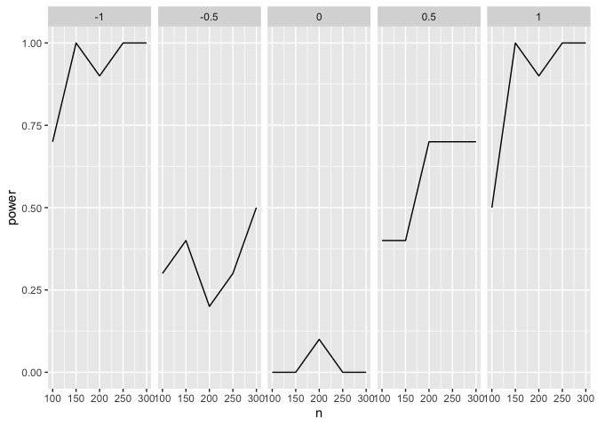

[](https://travis-ci.com/statisfactions/simpr)

# simpr

`simpr` provides a general, simple, and tidyverse-friendly framework for
specifying and generating simulations in R. It’s useful for power
analysis and other types of design analysis, as well as for generating
pedagogical examples of data. The philosophy of `simpr` is to **keep
simulations simple**. This means:

-   **Readable simulation specifications.** You can specify simulations
    in a few lines, including referring to other simulation variables
    and to simulation parameters that you’re varying (such as sample
    size). `simpr` takes care of all the details of generating your
    simulation across varying parameters, without the need for nested
    `for` loops or custom functions.

-   **Sensibly handle errors.** `simpr` has various options to keep
    going even when simulation or model-fitting hits errors, so that you
    don’t need to start over if a single iteration hits fatal numerical
    issues.

-   **Reproducible workflows.** Individual simulations can be reproduced
    exactly without needed to perform the whole simulation again.

-   **Easy-to-use parallel processing.** Building on `furrr`, parallel
    processing for `simpr` can be turned on with a couple lines of code.

The `simpr` workflow:

1.  Specify your data-generating process for each of your variables with
    `specify()`
2.  Define parameters that you want to systematically vary between
    different cells of your simulation design (e.g. *n*, effect size),
    with `define()`
3.  Generate the simulation data with `generate()`
4.  Fit models with your data (e.g. `lm()`), with `fit()`
5.  Tidy the model output for further processing, such as computing
    power or Type I Error rates, with `tidy_fits`

## Installation and loading

``` r
remotes::install_github("statisfactions/simpr")

library(simpr)
```

## A simple example

What’s our power to detect an interaction in a linear model? The entire
simulation and tidying happens in just a few lines of code:

``` r
set.seed(100)
simpr_tidy = ## Specify the simulation
  specify(x1 = ~ 2 + rnorm(n),
                       x2 = ~ 3 + 2*x1 + rnorm(n, 0, sd = 0.5),
                       y = ~ 5 + x1 + x2 + g1*x1*x2 + 10 * rnorm(n)) %>%
  ## Define varying parameters: here, sample size and effect size
  define(n = seq(100, 300, by = 50),
       g1 = seq(-1, 1, by = 0.5)) %>% 
  ## Generate 10 repetitions
  generate(10) %>% 
  ## Fit models
  fit(lm = ~lm(y ~ x1*x2))%>% 
  ## Tidy each simulation using broom::tidy and
  ## bind together
  tidy_fits
```

This gives a `tibble` with slope estimates and *p* values for all
parameters in the model.

``` r
simpr_tidy
```

    ## # A tibble: 1,000 × 10
    ##    .sim_id     n    g1   rep Source term    estimate std.error statistic p.value
    ##      <int> <dbl> <dbl> <int> <chr>  <chr>      <dbl>     <dbl>     <dbl>   <dbl>
    ##  1       1   100    -1     1 lm     (Inter…  -2.32       7.37   -0.314   7.54e-1
    ##  2       1   100    -1     1 lm     x1       -0.953      4.93   -0.193   8.47e-1
    ##  3       1   100    -1     1 lm     x2        2.46       2.07    1.18    2.39e-1
    ##  4       1   100    -1     1 lm     x1:x2    -0.921      0.372  -2.47    1.51e-2
    ##  5       2   150    -1     1 lm     (Inter…   7.23       5.31    1.36    1.75e-1
    ##  6       2   150    -1     1 lm     x1        3.13       3.80    0.824   4.11e-1
    ##  7       2   150    -1     1 lm     x2       -0.0135     1.57   -0.00861 9.93e-1
    ##  8       2   150    -1     1 lm     x1:x2    -0.982      0.256  -3.84    1.86e-4
    ##  9       3   200    -1     1 lm     (Inter…  16.4        5.55    2.96    3.43e-3
    ## 10       3   200    -1     1 lm     x1       -0.647      3.94   -0.164   8.70e-1
    ## # … with 990 more rows

We can easily filter this and compute power for each condition using
`dplyr`:

``` r
library(dplyr)
```

    ## 
    ## Attaching package: 'dplyr'

    ## The following objects are masked from 'package:stats':
    ## 
    ##     filter, lag

    ## The following objects are masked from 'package:base':
    ## 
    ##     intersect, setdiff, setequal, union

``` r
condition_power = simpr_tidy %>%
  filter(term %in% "x1:x2") %>%
  group_by(n, g1) %>%
  summarize(power = mean(p.value < 0.05)) 
```

    ## `summarise()` has grouped output by 'n'. You can override using the `.groups` argument.

``` r
condition_power
```

    ## # A tibble: 25 × 3
    ## # Groups:   n [5]
    ##        n    g1 power
    ##    <dbl> <dbl> <dbl>
    ##  1   100  -1     0.7
    ##  2   100  -0.5   0.3
    ##  3   100   0     0  
    ##  4   100   0.5   0.4
    ##  5   100   1     0.5
    ##  6   150  -1     1  
    ##  7   150  -0.5   0.4
    ##  8   150   0     0  
    ##  9   150   0.5   0.4
    ## 10   150   1     1  
    ## # … with 15 more rows

This can be easily plotted:

``` r
library(ggplot2)

condition_power %>% 
  ggplot(aes(n, power)) +
  geom_line() +
  facet_grid(~g1)
```



### Breaking down the example

First, we specify how we want the data to be generated:

``` r
simpr_spec = ## Specify the simulation
  specify(x1 = ~ 2 + rnorm(n),
                       x2 = ~ 3 + 2*x1 + rnorm(n, 0, sd = 0.5),
                       y = ~ 5 + x1 + x2 + g1*x1*x2 + 10 * rnorm(n)) %>%
  ## Define varying parameters: here, sample size and effect size
  define(n = seq(100, 300, by = 50),
       g1 = seq(-1, 1, by = 0.5)) 
```

The call to `specify()` contains the basics of what we actually want
simulated. Each argument is a named, one-sided formula that can include
functions like `rnorm` or whatever else you want, specified similar to
`purrr` formula functions. Note that these arguments include both
references to previously defined variables (`x1` and `x2`), and to some
other variables not yet defined (`n`, the sample size;and `g1`, the
interaction slope).

We can define these variables, which we call *metaparameters* of the
simulation, in the `define()` command. `define()` also takes named
arguments, and here we define what those metaparameters are. We can
specify them either as constants, or as lists or vectors; `simpr` will
generate all possible combinations of these metaparameters. We can view
the specification before actually running the simulation:

``` r
simpr_spec
```

    ## specify
    ## --------------------------
    ## $x1
    ## ~2 + rnorm(n)
    ## attr(,"varnames")
    ## [1] "x1"
    ## 
    ## $x2
    ## ~3 + 2 * x1 + rnorm(n, 0, sd = 0.5)
    ## attr(,"varnames")
    ## [1] "x2"
    ## 
    ## $y
    ## ~5 + x1 + x2 + g1 * x1 * x2 + 10 * rnorm(n)
    ## attr(,"varnames")
    ## [1] "y"
    ## 
    ## 
    ## conditions
    ## --------------------------
    ## # A tibble: 25 × 2
    ##        n    g1
    ##    <dbl> <dbl>
    ##  1   100  -1  
    ##  2   150  -1  
    ##  3   200  -1  
    ##  4   250  -1  
    ##  5   300  -1  
    ##  6   100  -0.5
    ##  7   150  -0.5
    ##  8   200  -0.5
    ##  9   250  -0.5
    ## 10   300  -0.5
    ## # … with 15 more rows
    ## 
    ## meta_info
    ## --------------------------

Above we can see the code for the data-generating process and all the
possible conditions. Now, we can run the simulation for each combination
using `generate()`:

``` r
simpr_gen = simpr_spec %>% 
  generate(2)

simpr_gen
```

    ## full tibble
    ## --------------------------
    ## # A tibble: 50 × 5
    ##    .sim_id     n    g1   rep sim               
    ##      <int> <dbl> <dbl> <int> <list>            
    ##  1       1   100  -1       1 <tibble [100 × 3]>
    ##  2       2   150  -1       1 <tibble [150 × 3]>
    ##  3       3   200  -1       1 <tibble [200 × 3]>
    ##  4       4   250  -1       1 <tibble [250 × 3]>
    ##  5       5   300  -1       1 <tibble [300 × 3]>
    ##  6       6   100  -0.5     1 <tibble [100 × 3]>
    ##  7       7   150  -0.5     1 <tibble [150 × 3]>
    ##  8       8   200  -0.5     1 <tibble [200 × 3]>
    ##  9       9   250  -0.5     1 <tibble [250 × 3]>
    ## 10      10   300  -0.5     1 <tibble [300 × 3]>
    ## # … with 40 more rows
    ## 
    ## sim[[1]]
    ## --------------------------
    ## # A tibble: 100 × 3
    ##       x1    x2      y
    ##    <dbl> <dbl>  <dbl>
    ##  1  1.38  5.26  -5.20
    ##  2  1.67  6.38  -2.88
    ##  3  2.90  9.08 -23.7 
    ##  4  1.14  5.21  12.6 
    ##  5  1.28  4.72   6.11
    ##  6  1.24  5.77   3.47
    ##  7  1.75  6.24   1.48
    ##  8  3.03  8.64  -9.34
    ##  9  2.11  7.68 -15.9 
    ## 10  3.19  8.69  -5.24
    ## # … with 90 more rows

`generate` has one argument, the number of repetitions for each
simulation. Here we generate 10 repetitions. This produces a `tibble`
with one row for each combination of metaparameters and repetition, and
a list-column with the generated data.

Note that `g1` is the same across the first 5 rows, but `n` varies, and
each element of `sim` is a tibble with the same number of rows as `n`.
Then, on the sixth row, we have the next value of `g1`, 0.5, and so on.
Each element of the column `sim` contains the generated `x1`, `x2`, and
`y`, and we already see the preview of `simpr_gen$sim[[1]]` in the
output above.

Next, we can fit a model on this data using the `fit()` function; this
uses similar formula syntax to `specify()`:

``` r
simpr_fit = simpr_gen %>% 
  fit(lm = ~lm(y ~ x1*x2))

simpr_fit
```

    ## full tibble
    ## --------------------------
    ## # A tibble: 50 × 6
    ##    .sim_id     n    g1   rep sim                lm    
    ##      <int> <dbl> <dbl> <int> <list>             <list>
    ##  1       1   100  -1       1 <tibble [100 × 3]> <lm>  
    ##  2       2   150  -1       1 <tibble [150 × 3]> <lm>  
    ##  3       3   200  -1       1 <tibble [200 × 3]> <lm>  
    ##  4       4   250  -1       1 <tibble [250 × 3]> <lm>  
    ##  5       5   300  -1       1 <tibble [300 × 3]> <lm>  
    ##  6       6   100  -0.5     1 <tibble [100 × 3]> <lm>  
    ##  7       7   150  -0.5     1 <tibble [150 × 3]> <lm>  
    ##  8       8   200  -0.5     1 <tibble [200 × 3]> <lm>  
    ##  9       9   250  -0.5     1 <tibble [250 × 3]> <lm>  
    ## 10      10   300  -0.5     1 <tibble [300 × 3]> <lm>  
    ## # … with 40 more rows
    ## 
    ## sim[[1]]
    ## --------------------------
    ## # A tibble: 100 × 3
    ##       x1    x2      y
    ##    <dbl> <dbl>  <dbl>
    ##  1  1.38  5.26  -5.20
    ##  2  1.67  6.38  -2.88
    ##  3  2.90  9.08 -23.7 
    ##  4  1.14  5.21  12.6 
    ##  5  1.28  4.72   6.11
    ##  6  1.24  5.77   3.47
    ##  7  1.75  6.24   1.48
    ##  8  3.03  8.64  -9.34
    ##  9  2.11  7.68 -15.9 
    ## 10  3.19  8.69  -5.24
    ## # … with 90 more rows
    ## 
    ## lm[[1]]
    ## --------------------------
    ## 
    ## Call:
    ## lm(formula = y ~ x1 * x2)
    ## 
    ## Coefficients:
    ## (Intercept)           x1           x2        x1:x2  
    ##      5.2005      -2.6840       1.2711      -0.7086

We don’t need to specify the dataset, because `fit` already computes
within the dataset. (We can specify it if needed using `.`.)

This just adds a list-column onto `simpr_gen` with the model fit for
each rep and metaparameter combination, and we see a preview of
`simpr_fit$lm[[1]]` in the output above now as well.

We can simplify this a lot more for power or design analysis by using
`tidy_fits()`, which runs `broom::tidy()` on each of the `lm` objects
and brings everything together into one data frame:

``` r
simpr_tidy = simpr_fit %>% 
  tidy_fits

simpr_tidy
```

    ## # A tibble: 200 × 10
    ##    .sim_id     n    g1   rep Source term    estimate std.error statistic p.value
    ##      <int> <dbl> <dbl> <int> <chr>  <chr>      <dbl>     <dbl>     <dbl>   <dbl>
    ##  1       1   100    -1     1 lm     (Inter…    5.20      7.58      0.686 4.94e-1
    ##  2       1   100    -1     1 lm     x1        -2.68      5.68     -0.472 6.38e-1
    ##  3       1   100    -1     1 lm     x2         1.27      2.11      0.603 5.48e-1
    ##  4       1   100    -1     1 lm     x1:x2     -0.709     0.389    -1.82  7.15e-2
    ##  5       2   150    -1     1 lm     (Inter…   -4.44      7.12     -0.624 5.34e-1
    ##  6       2   150    -1     1 lm     x1         4.65      4.52      1.03  3.06e-1
    ##  7       2   150    -1     1 lm     x2         2.69      2.00      1.34  1.82e-1
    ##  8       2   150    -1     1 lm     x1:x2     -1.60      0.363    -4.41  2.03e-5
    ##  9       3   200    -1     1 lm     (Inter…   14.2       6.09      2.34  2.05e-2
    ## 10       3   200    -1     1 lm     x1        -1.39      3.41     -0.407 6.84e-1
    ## # … with 190 more rows

This gives a data frame with one row for each term for each combination
of metaparameters for whatever we want to do with it.
